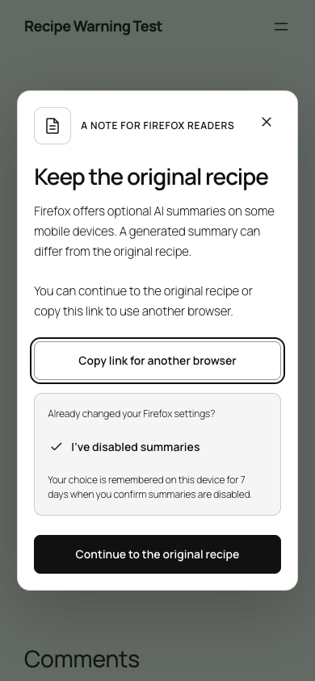
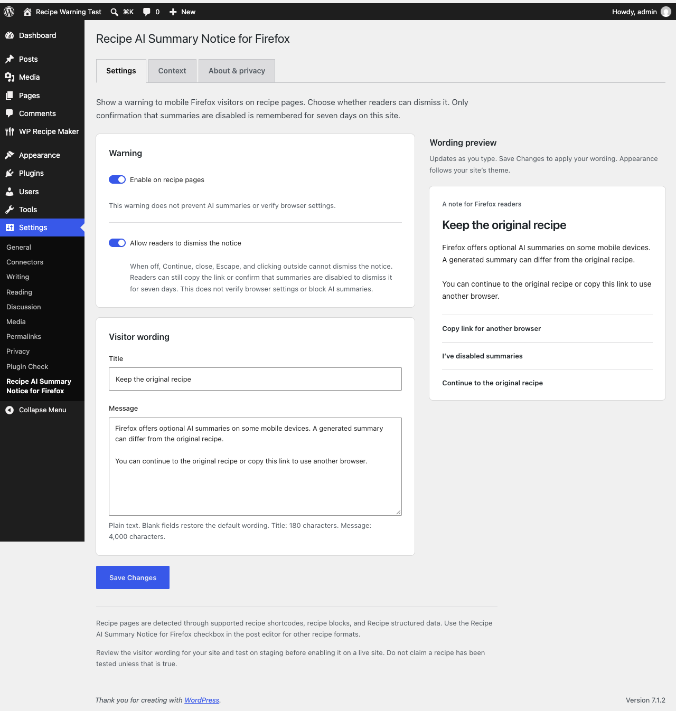

<div align="center">

# Recipe AI Summary Notice for Firefox

## Keep the original recipe

A dismissible WordPress notice for recipe readers using Firefox on Android or iOS.<br>
Give readers a clear path to the publisher’s original ingredients and instructions.

[](https://wordpress.org/)
[](plugin/recipe-ai-summary-notice/readme.txt)
[](plugin/recipe-ai-summary-notice/LICENSE.txt)

**[Download the WordPress plugin](https://github.com/And-or-Labs/recipe-ai-summary-notice/releases/download/v1.3.0/recipe-ai-summary-notice-1.3.0.zip)** · [Installation](#install) · [Test results](TESTING.md)

**The original recipe stays intact. The reader stays in control.**

</div>

Built by [And/or Labs Inc.](https://github.com/And-or-Labs). **Original idea: Don Marti**, from his [discussion about recipe sites and Firefox summaries](https://www.linkedin.com/posts/dmarti_should-recipe-sites-start-blocking-firefox-share-7511824622989008896-pGED/). And/or Labs implemented the plugin; this credit does not imply that Don developed, reviewed, or endorsed the release.

## For readers. For publishers.

<table>
<tr>
<th>Reader notice</th>
<th>Publisher settings</th>
</tr>
<tr>
<td align="center"><a href="artifacts/mobile-warning.png"></a></td>
<td align="center"><a href="artifacts/settings.png"></a></td>
</tr>
<tr>
<td>Continue to the original recipe or copy its link. Confirming that summaries are disabled remembers that choice for seven days.</td>
<td>Edit the notice title and message. Use automatic recipe detection or mark a recipe manually. Review the sourced context and privacy details.</td>
</tr>
</table>

## Why this exists

On October 1, 2026, Mozilla described how Firefox uses recipe-specific prompts and webpage structured data to produce recipe summaries. Mozilla reports improvements in completeness and accuracy from those changes. Generated summaries can still differ from the original page; this plugin gives publishers a way to remind readers where the original recipe lives. [Mozilla’s engineering article](https://blog.mozilla.org/en/firefox/firefox-ai/prompt-tuning-firefox-shake-to-summarize-recipes/)

Summary availability varies by browser version, device, and rollout. The plugin does not assume every Firefox visitor has summaries enabled or that every summary is wrong. Mozilla’s [Android instructions](https://support.mozilla.org/en-US/kb/summarize-pages-android) and [iOS instructions](https://support.mozilla.org/en-US/kb/summarize-pages-ios) describe the controls. Disabling only the shake gesture may leave summaries available through other controls.

## What it does

- Shows a notice when a browser identifies itself as Firefox on Android or iOS and the page is recognized as a recipe.
- Lets readers continue immediately or dismiss with Escape. Confirming that summaries are disabled suppresses the notice for seven days on that site in that browser.
- Offers a copy-link button with a selectable URL fallback when clipboard access fails.
- Recognizes Recipe JSON-LD and microdata, WP Recipe Maker, and supported recipe blocks and shortcodes. An editor checkbox covers other formats.
- Provides editable plain-text notice copy and native WordPress Context and About & privacy settings tabs.
- Leaves recipes and structured data intact. Browser-side detection keeps user-agent-specific HTML out of shared page caches.

The notice uses a native modal dialog with keyboard controls and focus restoration. It inherits theme typography and colors, checks text contrast, and supports narrow viewports and reduced motion. Missing JavaScript or modal support leaves the original page available.

WordPress.org submission: **awaiting review**. The tested release ZIP is available now from GitHub.

## Install

Requires WordPress 6.4 or later and PHP 7.4 or later.

1. Download [recipe-ai-summary-notice-1.3.0.zip](https://github.com/And-or-Labs/recipe-ai-summary-notice/releases/download/v1.3.0/recipe-ai-summary-notice-1.3.0.zip).
2. In WordPress, open **Plugins > Add New Plugin > Upload Plugin**, select the ZIP, and activate Recipe AI Summary Notice for Firefox.
3. Review the title and message under **Settings > Recipe AI Summary Notice for Firefox** and test a recipe on a staging site.
4. For an unrecognized recipe format, enable **Treat this as a recipe page** in the post editor.

Upgrading from Recipe Warning 1.1.0: deactivate the old plugin before activating this renamed plugin. Settings and recipe flags are retained.

Use the plugin release ZIP for installation. GitHub’s source-code archives contain development files as well.

## Limits

The plugin displays a notice. It cannot block scraping or summarization, change or verify browser settings, or establish whether a visitor has Firefox’s summary feature. Browser identification and recipe detection are approximate. Password-protected pages, archives, feeds, and embeds are excluded.

Metadata scanning is bounded to keep pages responsive. Recipes inserted after page readiness, unusual formats, and metadata exceeding the scan limits should use the manual editor checkbox. See the [plugin documentation](plugin/recipe-ai-summary-notice/readme.txt) for the limits and supported behavior.

The plugin does not assess recipes, generated summaries, allergens, nutrition, or food safety. It makes no claim that a publisher’s recipes were tested and does not guarantee copyright protection or legal compliance. Publishers control their notice wording and remain responsible for their content.

## Privacy

No analytics, tracking cookies, external services, remote assets, or AI calls are added by the plugin. Browser identification is checked locally.

An explicit disabled-summary confirmation stores only an expiry timestamp under `recipe-warning-bypass-v1` in the site’s localStorage. The preference lasts seven days; expired or invalid entries are removed when next checked. Continue and Escape save no preference. Copying a link writes the current URL to the clipboard only when selected.

WordPress settings and manual recipe flags remain in the database after uninstall. Other parts of the site, its hosting, and the browser have separate data practices. See [context and disclosures](docs/CONTEXT-AND-DISCLOSURES.md) for details.

<details>
<summary>Development and verification</summary>


Plugin source is in [`plugin/recipe-ai-summary-notice/`](plugin/recipe-ai-summary-notice/). Local WordPress sites and dependencies are excluded from version control. Create a disposable WordPress Studio site in `site/`, copy the plugin directory into its `wp-content/plugins/` directory, activate it, and install WP Recipe Maker for its integration fixtures.

```sh
npm ci
npx playwright install firefox webkit
studio site start --path ./site --skip-browser
cp tests/seed.php site/recipe-warning-seed.php
studio wp --path ./site eval-file "$PWD/site/recipe-warning-seed.php" > tests/fixtures.json
npm test
```

The browser suite defaults to port 8881; set `RW_SITE_URL` for another local site URL. The Chrome project currently targets an installed macOS Google Chrome executable in [`playwright.config.js`](playwright.config.js); adjust that path for your environment. Firefox and WebKit use Playwright’s installed engines.

Build the upload archive with:

```sh
python3 scripts/package.py
```

The [verification record](TESTING.md) covers browser behavior, permissions and sanitization, storage and clipboard failures, metadata stress cases, accessibility checks, local HTTP load testing, and WordPress Plugin Check. Mobile identities and viewports are emulated; these checks do not test physical mobile devices or Firefox’s summary generation. The [WebKit environment note](docs/WEBKIT-TEST-ENVIRONMENT.md) records the test-specific WordPress emoji workaround. Local review and packaging details are in the [release notes](docs/RELEASE.md).


</details>

## License and independence

[GPL version 2 or later](plugin/recipe-ai-summary-notice/LICENSE.txt). Provided without warranty to the extent permitted by applicable law. The documentation supplies technical information, not legal advice or immunity from claims.

Recipe AI Summary Notice for Firefox is independent of Mozilla and the WordPress project. Firefox and Mozilla are trademarks of the Mozilla Foundation in the United States and other countries. Product names identify their respective products and owners; no affiliation or endorsement is implied.
